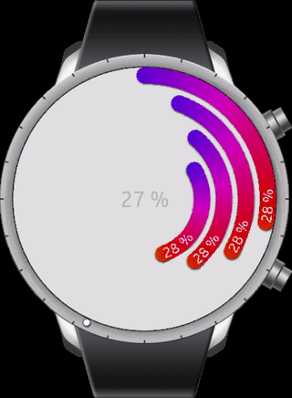

``` c#
var progressbar = new ProgressBar();
Device.StartTimer(TimeSpan.FromMilliseconds(10), () =>
{
    if (progressbar.Progress == 1.0)
        progressbar.Progress = 0;
    progressbar.Progress += 0.001;
    return true;
});
```


``` xml
<?xml version="1.0" encoding="utf-8" ?>
<ContentPage xmlns="http://xamarin.com/schemas/2014/forms"
             xmlns:x="http://schemas.microsoft.com/winfx/2009/xaml"
             xmlns:local="clr-namespace:Sample"
             x:Class="Sample.MainPage">
    <ContentPage.Content>
        <AbsoluteLayout 
            BackgroundColor="White"
            VerticalOptions="FillAndExpand" HorizontalOptions="FillAndExpand">
            <local:CircleProgressbar x:Name="Progress"
                                     AbsoluteLayout.LayoutBounds="0, 0, 1, 1"
                                     AbsoluteLayout.LayoutFlags="All"/>
            <local:CircleProgressbar x:Name="Progress2" Rotation="20"
                                     AbsoluteLayout.LayoutBounds="30, 30, 300, 300"
                                     AbsoluteLayout.LayoutFlags="None"/>
            <local:CircleProgressbar x:Name="Progress3" Rotation="40"
                                     AbsoluteLayout.LayoutBounds="60, 60, 240, 240"
                                     AbsoluteLayout.LayoutFlags="None"/>
            <local:CircleProgressbar x:Name="Progress4" Rotation="60"
                                     AbsoluteLayout.LayoutBounds="90, 90, 180, 180"
                                     AbsoluteLayout.LayoutFlags="None"/>

            <Label x:Name="Label" Text="{Binding Progress, Source={x:Reference Progress}, StringFormat='{0:P0}'}"
                   HorizontalTextAlignment="Center"
                   VerticalTextAlignment="Center"
                   AbsoluteLayout.LayoutBounds="0, 0, 1, 1"
                   AbsoluteLayout.LayoutFlags="All"/>
        </AbsoluteLayout>
    </ContentPage.Content>
</ContentPage>
```
