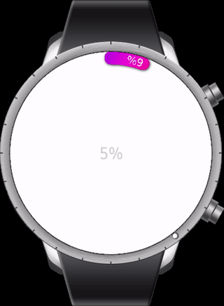

``` c#
var progressbar = new ProgressBar();
Device.StartTimer(TimeSpan.FromMilliseconds(10), () =>
{
    if (progressbar.Progress == 1.0)
        progressbar.Progress = 0;
    progressbar.Progress += 0.001;
    return true;
});
```
